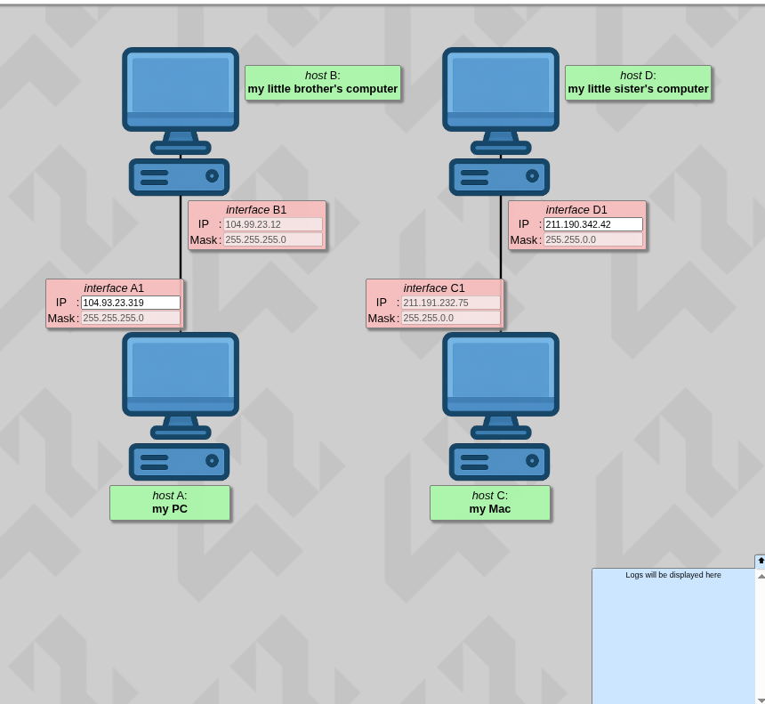
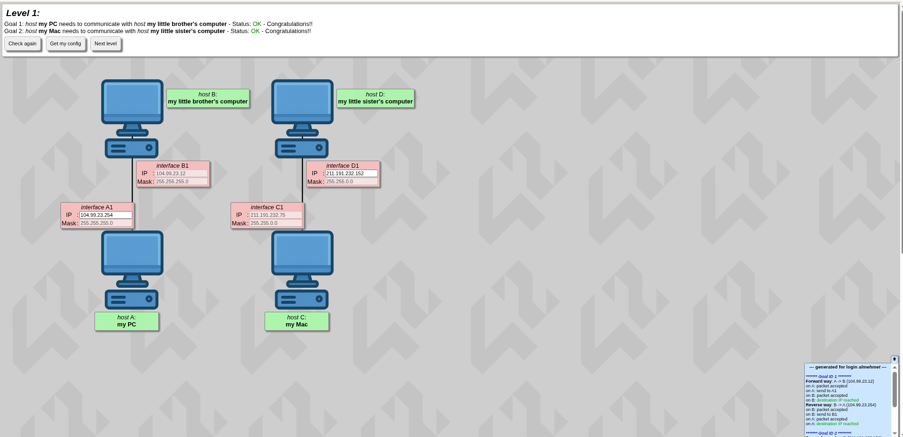

# Net Practice — Level 1

---

## What's Going On


In Level 1 you have two independent direct connections:

```
Host A  <──────────>  Host B      (direct cable)
Host C  <──────────>  Host D      (direct cable)
```

If you look at the topology, Host A and Host B are directly connected to each other — so their **subnet masks must be the same**.
Same for Host C and Host D — both on the same direct connection, so they must also have the **same subnet mask**.

---

## Pair 1 — Host A and Host B

### Given

- Host B static IP: `104.99.23.12`
- Subnet mask (both): `255.255.255.0` *(static)*

### Step 1 — Read the mask

Mask is `255.255.255.0` → the first 3 numbers are the **Street**, the last number is the **House**.

```
104.99.23 . 12
└────────┘   └─ House number (host)
  Street (network)
```

So Host A must also be on street `104.99.23.x`.

### Step 2 — Find the usable range

```
Block Size = 256 - 0 = 256

Range:     .0  to  .255
Reserved:  .0  (Network)  and  .255  (Broadcast)
Usable:    .1  to  .254
```

### Step 3 — Assign Host A

Host B is already on `.12`, so pick any number from `.1` to `.254` except `.12`:

```
Host A:  104.99.23.1     Mask: 255.255.255.0
Host B:  104.99.23.12    Mask: 255.255.255.0  ← static (given)
```

✅ Same street (`104.99.23`) — different house numbers (`.1` vs `.12`) — they can communicate.

---

## Pair 2 — Host C and Host D

### Given

- Host C static IP: `211.191.232.75`
- Subnet mask (both): `255.255.0.0` *(static)*

### Step 1 — Read the mask

Mask is `255.255.0.0` → the first 2 numbers are the **Street**, the last 2 numbers are the **House**.

```
211.191 . 232.75
└─────┘   └─────── House number (host)
  Street (network)
```

So Host D must also be on street `211.191.x.x`.

### Step 2 — Find the usable range

```
Mask last two octets: 0.0

Range:     211.191.0.1  to  211.191.255.254
Reserved:  211.191.0.0  (Network)  and  211.191.255.255  (Broadcast)
```

### Step 3 — Assign Host D

Host C is already on `211.191.232.75`, so pick any IP in the same network:

```
Host C:  211.191.232.75    Mask: 255.255.0.0  ← static (given)
Host D:  211.191.232.76    Mask: 255.255.0.0
```

> `.232` is static here, so that's why we use it — but if it wasn't, we could have chosen anything we'd like for the third octet.

✅ Same street (`211.191`) — different house numbers — they can communicate.

---

## Summary

| Host | IP Address | Subnet Mask | Note |
|------|-----------|-------------|------|
| Host A | `104.99.23.1` | `255.255.255.0` | you assign |
| Host B | `104.99.23.12` | `255.255.255.0` | static (given) |
| Host C | `211.191.232.75` | `255.255.0.0` | static (given) |
| Host D | `211.191.232.76` | `255.255.0.0` | you assign |

---

## Checklist Before Submitting

- [ ] Host A and Host B have the **same mask** and the **same first 3 octets**
- [ ] Host A and Host B have **different last octets**
- [ ] Host C and Host D have the **same mask** and the **same first 2 octets**
- [ ] Host C and Host D have **different host portions**
- [ ] None of your IPs end in `.0` or `.255` — those are reserved


