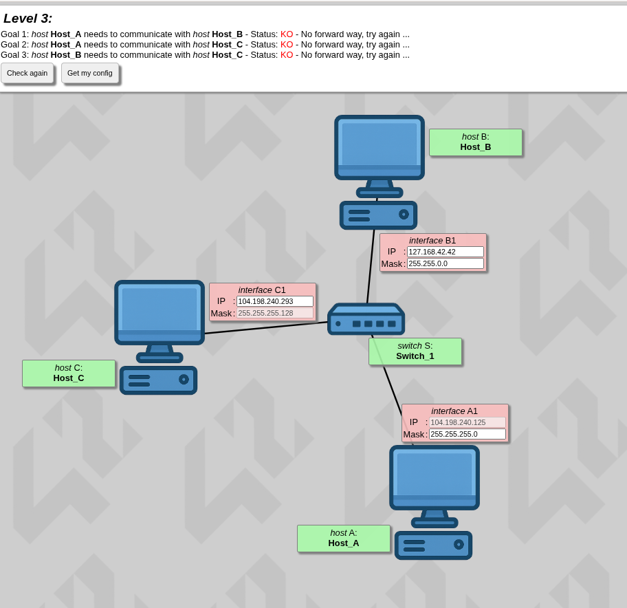
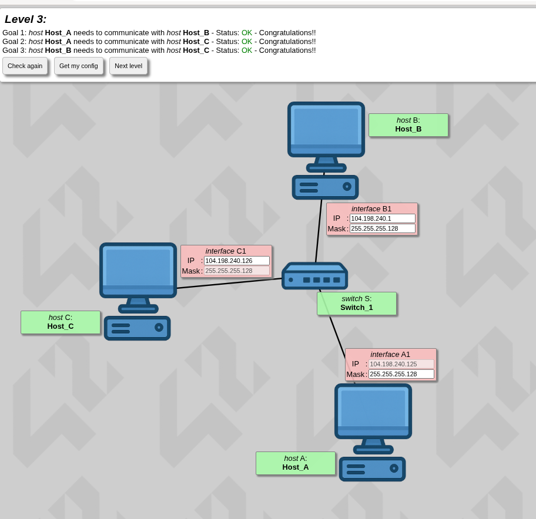

# Level 3

so as you can see we now are dealing with a switch.

**Theory — what is a switch:**

a switch is a smart hardware device that connects multiple devices (computers, printers, servers) together to form a Local Area Network (LAN). think of it as the ultimate power strip for network cables.

it operates at **Layer 2 (Data Link Layer)** — a switch doesn't care about IP addresses. instead, it looks at a device's **MAC Address** (Media Access Control). a MAC address is the hardcoded, unchangeable physical fingerprint built into every network card at the factory.

**a funny way to understand this:**

> think of the switch as a WhatsApp Group Chat or a Discord Server. the switch physically connects everyone to the group, but to actually read and reply to messages, everyone has to be in the exact same channel.

---

so to solve our exercise we need hosts A, B and C to have the same subnet mask.

since host C has a fixed subnet mask, we use that one.

now we see something wrong with the IP of host C:

host A has a fixed IP of `104.198.240.125` so we'll continue with that network after finding the usable host range.

what we have is `104.198.240.293` — the problem is **293** which is impossible since an octet cannot go past **255**.

---

now we need to find the usable host range:

```
256 - 128 = 128
```

- block 1 is **(0-127)** where 0 and 127 are administrative landmarks → usable host range **[1-126]**
- block 2 is **(128-255)** where 128 and 255 are administrative landmarks → usable host range **[129-254]**

---

so now that we found the usable host range, we can assign IPs.

**Crucial Rule:** the first three octets (`104.198.240.X`) must be exactly the same for all hosts so they stay in the same network, but each computer must get its own unique ending number from the usable range. no sharing identical IPs!

as you can see, the project passed.


