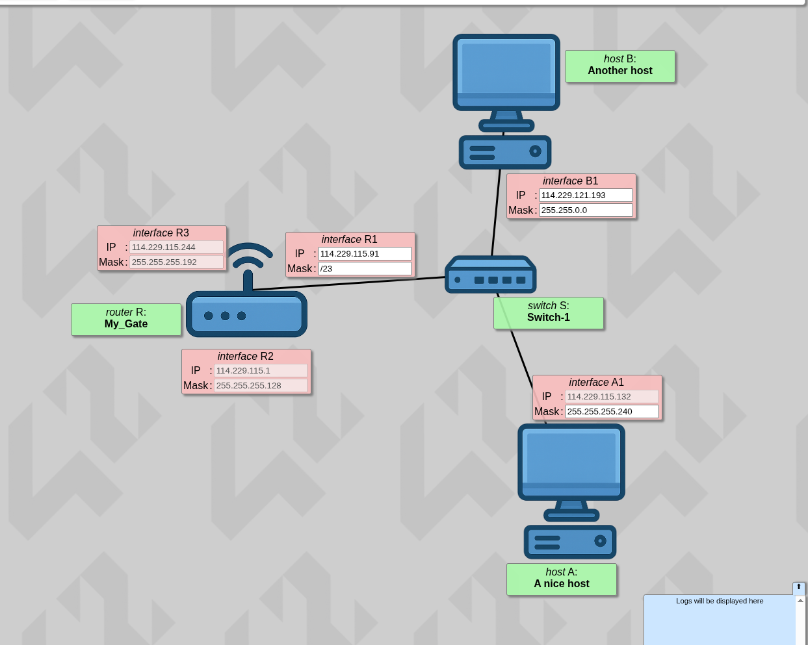
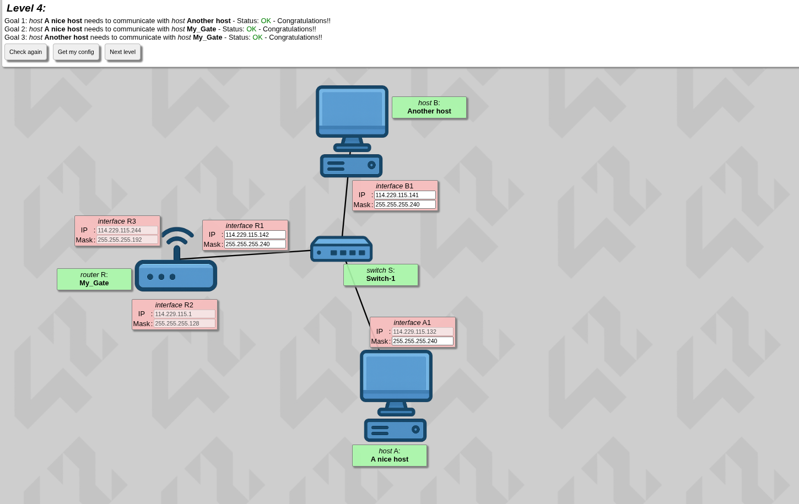

# Router — A New Concept

## Theory

Think of a Gate (or Gateway) as the exit door of your local neighborhood.

Right now, Host A, Host B, and Switch-1 are all hanging out in the same room. They can talk to each other directly through the switch without any help.

But what happens if Host A wants to talk to a wireless device on interface R3, or visit a website on the internet?

---

## Golden Rule

A router's entire job is to sit between different networks and bridge them. Because of this:

**Every single interface (port) on a router must belong to a different subnet.**

If R1, R2, and R3 were all in the same subnet, the router would get confused. When traffic came in, it wouldn't know which physical port to send the data out of.

---

## Finding the Usable Host Range for A1

So from the photo we have that the A1 subnet mask is 240, and we can use that since we learned previously that the network host has to be the same and we have to use a usable host range.

256 - 240 = 16

So since A1 has a static IP of:

114.229.115.132

Block 1 is 0-15, usable range [1-14].

Now what's next is that we need to find a usable host range for us:

132 ÷ 16 = 8.25

So it means till 128 (8×16) is when a block ends — but don't forget that we also have 0 in the equation, so technically it ends at 127.

**128 - 143** (16 digits) where the usable host range is **(129 - 142)**

