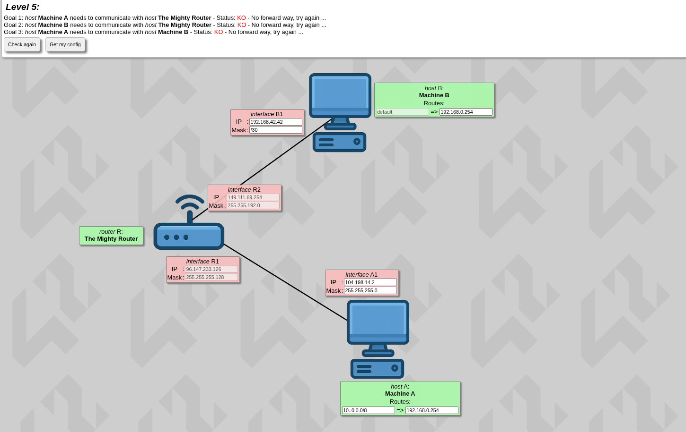
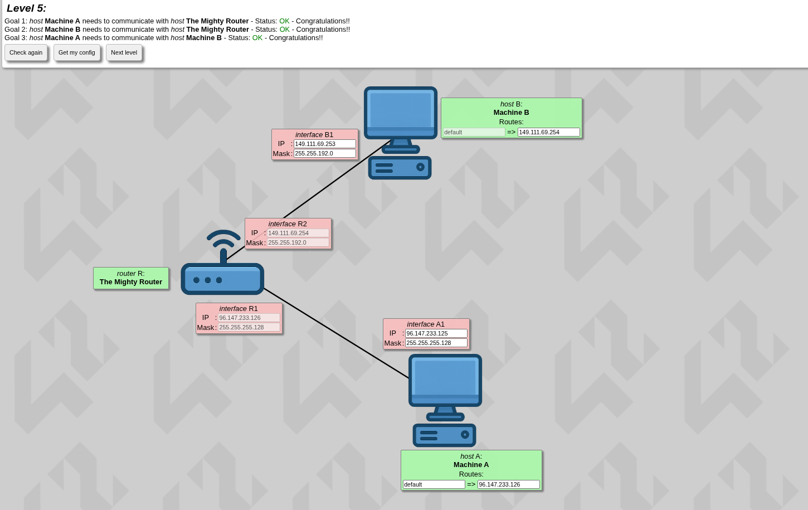

```markdown
# Level 5

## Theory and New Concepts

### Routing Tables
A "cheat sheet" that tells a device exactly which local router to hand data to when the destination is outside its network.

### Default Route
(default => IP): The catch-all rule. "If I don't know where this goes, just send it to this IP."

### Static Route
(Network => IP): A specific rule. "If data is going to this exact network, send it to this specific IP."

### The Golden Rule
The "Next Hop" IP (the right side of the arrow) must be inside the sender's local subnet. You cannot hand a packet to a router you cannot locally reach.

---

## Applying It

"Host B1 is connected to interface R2, so they need to be in the same subnet. This means their IPs must fall inside the exact same block range based on our subnet math!"

Now for the machine of Host B, we don't know where the data is going, so just send it to R2.

Host A has to have the same subnet mask as R1, and now you can calculate the IP yourself.

So now we have machine A — what is it trying to do? It's trying to send data to machine B. That's why after the `=>` we choose the IP of R1, so it can send back the data. But what to do prior to that:

---

## Why Do We Choose Default for the Other One?

A funny way to get this:

Imagine you are standing in a house that only has one front door leading to the outside world.

Do you need a giant, specific map taped to the inside of your door detailing the exact coordinates of the grocery store, the bank, and the post office?

No. Because no matter where you are going, your first step is always exactly the same: walk out that one front door.

So it figures itself out where to go.
```

