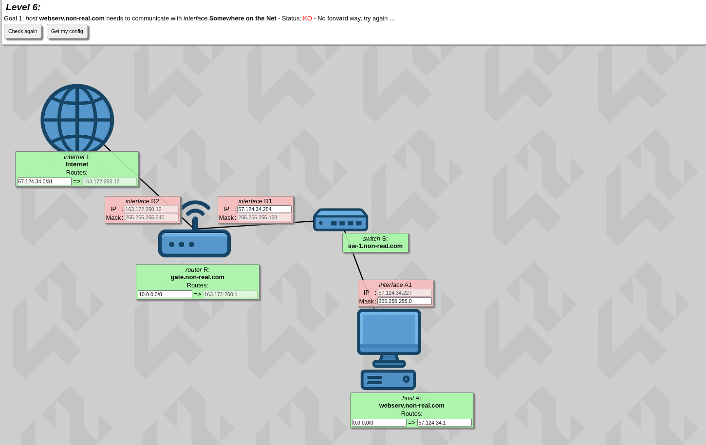
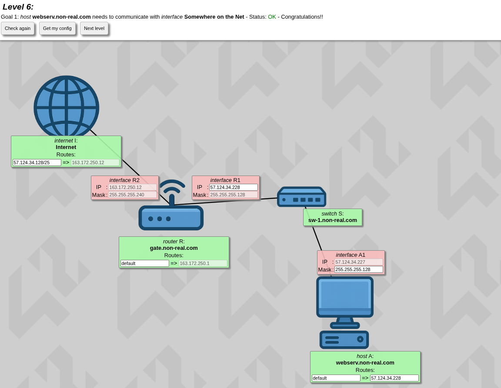

# Level 6

The new thing you are seeing is the internet.

---

## Theory

### The Internet is Just Another (Massive) Router

In networking, there is no magical cloud. The "Internet" component on this map represents the rest of the world, but mechanically, it functions just like another router. It has its own routing table (a map), and it needs instructions on where to send things.

---

## Applying It

You can use the skills you have acquired from the previous levels.

The subnet mask of R1 is static at **255.255.255.128**, and since R1 and A1 are connected through a switch, they need to have the same mask — only the host part needs to change.

256 - 128 = 128

Since A1 is static at **57.124.34.227**, the usable host range is in the second block from [128-255]. As you know, the starting and ending points are administrative landmarks, so the usable host range is **[129-254]** — so just assign **.228** to R1.

Now at the router, since there is only one way it can go, just put **default** there. It's pointing at an IP that's not on this level, but you can think of it like this:

> The Level 6 map is just showing your house, and the IP it's pointing to is outside of it.

---

## What to Put at the Internet

The internet is trying to reach Host A, but the thing is it doesn't know where Host A lives. We calculated that it's in the second block **128-255**.

### The Rule for Devices vs. Routers

**For Devices (Hosts/Interfaces):** You are NOT allowed to assign .128 or .255 to a specific computer, phone, or router port. Devices need specific house numbers — the usable range of **.129 to .254**.

**For Routing Tables (The Map):** You MUST use the .128 landmark.

### So what will you do for the internet??
So what you need to assign is the first part of the street (the administrative landmark), followed by the subnet mask:

255.255.255.128

11111111.11111111.11111111.10000000

As you can see there are 25 bits set to 1, so the mask is **/25**. And that's what you put after the IP:

**57.124.34.128/25**

As you can see, it's sending data out to **163.172.250.12** which is outside of the house.

