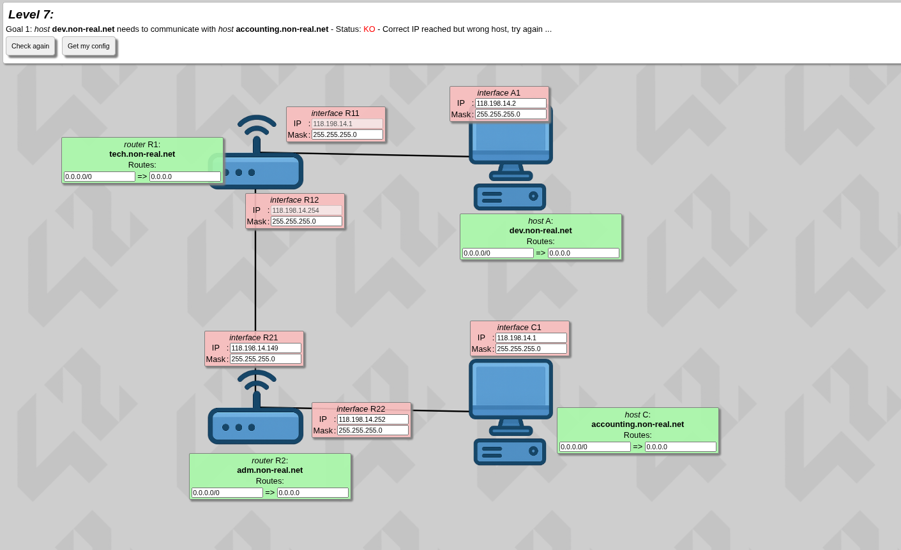
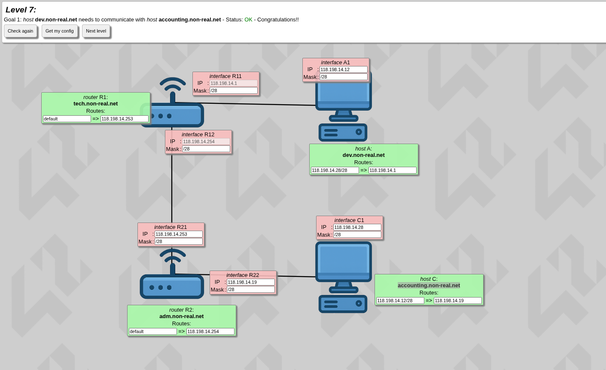

# Level 7

So in level 7 we have these 4: 2 routers and 2 hosts — nothing new right?

---

## The Problem

We see that the subnet for all is the same **255.255.255.0**. Having the same subnet is okay, but the thing is how much of the usable range each one of them occupies. Since the mask is a **/24** it occupies a usable host range from **[1-254]** — so what do we do?

Let's just use a **/28** — it leaves enough usable host range for each one of them.

---

## Applying It

So now just put each mask at **/28**, then fix each IP.

256 - 240 = 16

- **Block 1:** [0-15] — where 0 and 15 are administrative landmarks, usable range [1-14]
- **Block 2:** [16-31] — where 16 and 31 are administrative landmarks, usable range [17-30]

---

## Assigning the IPs

**R11** has a fixed IP, so we use that for A1 and just change the last part (the host IP) to anything in [1-14]. I'm choosing 12:

- A1 → `118.198.14.12`

**R12** has a fixed IP, and 254 is one of the last usable ones, so we just change R21's IP to 253 and it's fine:

- R21 → `118.198.14.253`

**R22's** IP has to have the same network IP as C1, so we find the second block [16-31]:

- R22 → `118.198.14.19`
- C1 → `118.198.14.28`

---

## Routing Tables

**Router R1 — tech.non-real.net**

We choose default since there is only one way, and send it to the IP of R21 as it's the forward direction.

**Router R2 — adm.non-real.net**

For the backward way we do the same:

- default => IP of R12

**Host A — dev.non-real.net**

Host A is exchanging data with Host C. So:
- First box → IP of Host C with its subnet mask
- Second box → IP of Router R1, since it's communicating through it

**Host C — accounting.non-real.net**

Host C is getting data from Host A. So:
- First box → IP of Host A with its subnet mask
- Second box → IP of R22, since that's the route it's coming through

---

After that, Level 7 is solved!

