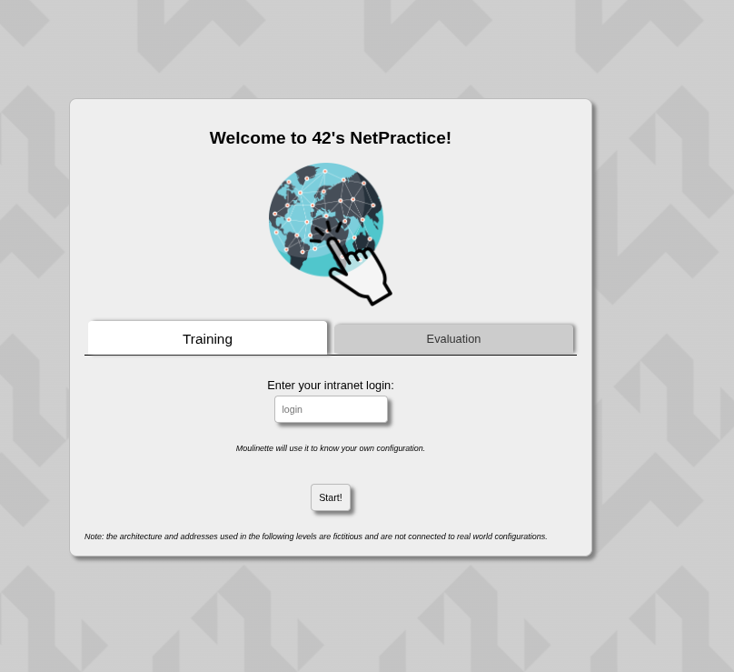

# Net Practice — Complete Guide

> 42 School Networking Project

---

## 1. Getting Started

### Step 1 — Download & Extract

First thing, download the resources you get, then extract them.

### Step 2 — Navigate the Project

Once extracted, go into the `net_practice` folder. You'll see something like this:

```
net_practice/
  css/
  js/
  img/
  index.html
  level1.html  ...  level10.html
  end.html
  run.sh
  License
```

### Step 3 — Run the Project

When you're at the root and have all the files, run:

```bash
./run.sh
```


A page will open in your browser. Just put your **42 login** in the login tab — the program will then load your first exercise.

---

## 2. Theory

### What is an IP Address?

An IP address (Internet Protocol address) is sorta like a home address. If one house wants to send a letter (data) to another house, it needs an exact address.

It uses a four-part format, for example:

```
104.99.23.12
```

The problem: by just looking at the numbers, you can't tell which part is the **street** and which part is the **house**. That's where the mask comes in.

---

### What is a Subnet Mask?

The Subnet Mask's only job is to draw a line in the IP address and say:

> *"Everything on the left is the Street Name, everything on the right is the House Number."*

**In summary:**

| | |
|---|---|
| **IP Address** | My location |
| **Mask `255.255.255.0`** | First 3 numbers = my Street / Last 1 number = my House |
| **Mask `255.255.0.0`** | First 2 numbers = my Street / Last 2 numbers = my House |

**Direct Connection rule:**
- Our Street numbers must be **identical**
- Our House numbers must be **different**

---

## 3. How to Calculate the IP Range from a Mask

The formula is simple:

```
Block Size = 256 - (last octet of the mask)
```

The block gives you the range. Inside every block:
- The **first address** → Network Address (reserved, not usable)
- The **last address** → Broadcast Address (reserved, not usable)
- **Everything in between** → usable host range ✅

---


### Example 1 — Mask `255.255.255.0`

```
Block Size = 256 - 0 = 256

Range:     .0  to  .255
Reserved:  .0   (Network Address)
           .255 (Broadcast Address)
Usable:    .1  to  .254
```

So if Host B has a static IP of `104.99.23.12`, Host A can be anything from `.1` to `.254` — except `.12` since it's already taken.

---

### Example 2 — Mask `255.255.255.252`

```
Block Size = 256 - 252 = 4

Block 1:  .0  - .3    →  usable: .1  and  .2   (0 and 3 are reserved)
Block 2:  .4  - .7    →  usable: .5  and  .6   (4 and 7 are reserved)
Block 3:  .8  - .11   →  usable: .9  and  .10  (8 and 11 are reserved)
... and so on
```

---

### Example 3 — Mask `255.255.0.0`

With this mask the first 2 numbers of the IP are for the **network** and the last 2 are for the **host**.

```
IP:    211.191.232.75
Mask:  255.255.0.0

Range:  211.191.0.1  to  211.191.255.254
```

`.232` is static in this case so that's why we choose it — but if it wasn't, we could have chosen anything we'd like for the third octet.
